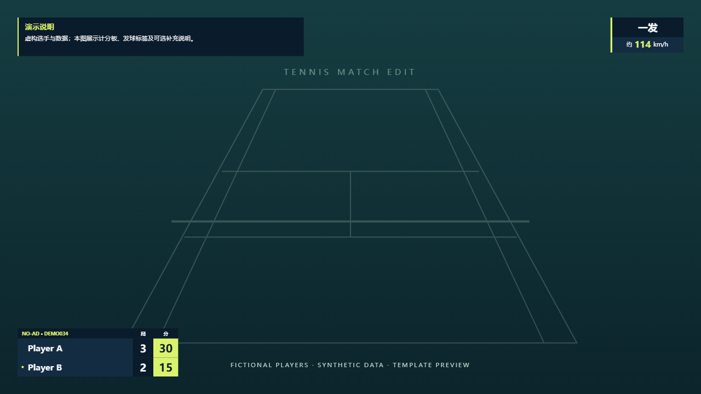
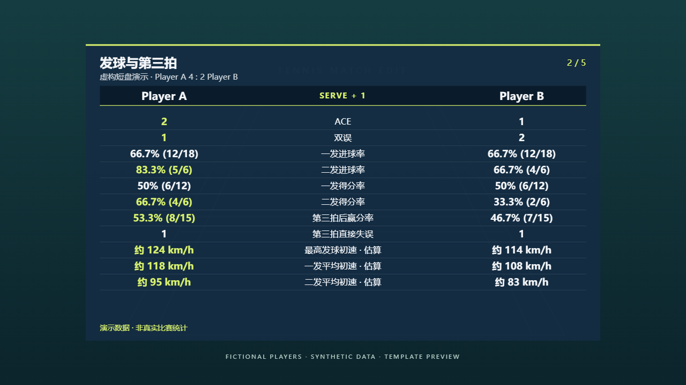
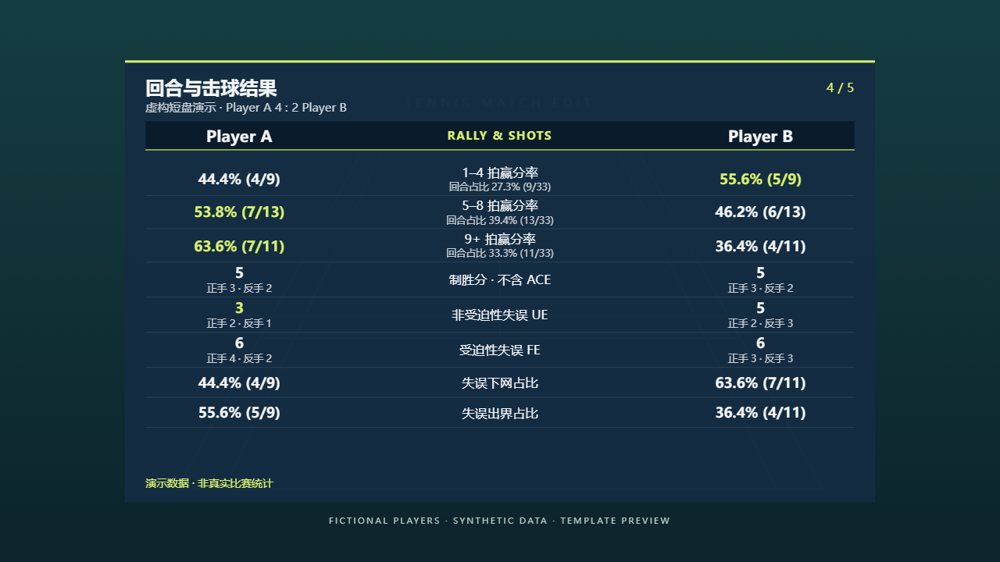

# Tennis Match Edit

**A reusable agent skill for turning tennis recordings into point-by-point edits,
auditable scoring, and compact match statistics.**

[中文说明](README.zh-CN.md) · [Skill entry](skills/tennis-point-edit-review/SKILL.md) · [Gallery](docs/gallery.md) · [Account sync](docs/synchronization.md)



*Every screenshot uses fictional Player A / Player B data and a generated court
illustration. No match footage, player identities or measured serve speeds are included.*

## What it does

- Cuts individual points while keeping the first dead ball and necessary reactions.
- Separates visual outcome, adopted ruling, rules-based score and onsite notation.
- Creates a compact review timeline and an offline interactive list whose rows stay visible.
- Derives five statistics pages from point and shot events, including FH/BH outcomes,
  independent UE/FE classification, and movement counts **within UE**.
- Estimates launch speed for every included serve, then adds post-contact speed labels.
- Reuses the navy/lime scoreboard, review labels, notes and statistics templates.

The workflow begins with a short introduction unless the user opts out. The agent
does the detailed checking; the user sees only remaining material uncertainties.

## Preview





The default panel has **5 pages, 39 main comparison rows, 8 seconds per page**.
Higher/lower comparison rules choose the highlighted main value; descriptive
distributions stay neutral. See [all five pages](docs/gallery.md).

## Install and use

This repository keeps its independently installable package under
`skills/tennis-point-edit-review/`. From a clone, a compatible Skills CLI can install it:

```sh
npx skills add . --skill tennis-point-edit-review
```

Local-path installation is supported by the [Skills CLI](https://github.com/vercel-labs/skills).
You can also copy the **whole skill folder**, including references, examples and
scripts, into a skill directory supported by your agent.

In ChatCut, ask the connected agent to save/update this folder as your personal
workflow Skill, then select it from **My Skills**. A generic skill installation
does not install ChatCut's editing capabilities: actual editing needs a connected
video editor, media access and visual inspection.

Example request:

> Use the tennis point-edit-review skill on this singles match. Player A wears
> white and is right-handed; Player B wears blue and is left-handed. It is a
> four-game, no-ad set. Produce the point edit, necessary review list and statistics.

## Repository layout

```text
skills/tennis-point-edit-review/  Complete portable skill package
  SKILL.md                      Workflow entry and required references
  references/                   Rules, definitions, validation and history
  examples/                     Seven canonical JSX components and review HTML
  scripts/                      Evidence, scoring, aggregation and checks
demo/                           Reproducible fictional data and screenshot renderer
docs/                           Gallery, publishing and synchronization guides
tools/                          Validation, packaging and conflict-aware snapshot sync
.github/workflows/              Automated validation
```

The package retains the adopted v18 rules and historical preservation map.
Repository release `0.1.0` and skill revision `2026.10.03-v18.1` are separate labels.

## Reproduce the demonstrations

Python 3.10+ and Node.js 20+ are used for repository maintenance.

```sh
python -m pip install -r requirements-dev.txt
npm ci
npm run demo:build
npm run demo:capture
python tools/validate.py
```

The renderer compiles the **actual JSX templates**, with a fixed preview frame.
Screenshots are captured by Playwright CLI; no alternate hand-drawn panels are used.
A local browser is required; if none is available, install one using
`npx playwright-cli install-browser chromium`.
Generated working pages are ignored under `output/playwright/`; selected PNGs
are kept under `docs/images/`. See [demo notes](demo/README.md).

## Maintain one source and sync deliberately

Use this Git repository as the durable, reviewable source. The account-saved Skill
is a reusable copy managed by ChatCut, **not a Windows folder that Git can watch**.

You can still update the account first, then ask an agent to retrieve its complete
package, compare it with this repository, merge changes, run checks, and commit.
That is an explicit sync operation, not automatic bidirectional synchronization.
The included helper handles exported files and conflicts; it does not log in to
ChatCut or push to GitHub. See [the synchronization guide](docs/synchronization.md).

## Scope and limits

Designed for singles: regular/short sets, advantage/no-ad, timed play and point
tiebreaks. Doubles requires explicit rule and service-order adaptation.
Scoring and stroke classifications require source evidence; estimated serve
launch speeds are not radar measurements. Unknown observations remain unknown.

## Contributing and license

Read [CONTRIBUTING.md](CONTRIBUTING.md). Code, skill text and original demo assets
are available under the [MIT License](LICENSE). External articles, brands and
installed dependencies retain their own licenses; see [notices](THIRD_PARTY_NOTICES.md).

Repository organization draws on the self-contained skill folders used by
[Anthropic Skills](https://github.com/anthropics/skills) and
[Remotion Skills](https://github.com/remotion-dev/skills). No upstream skill or
template code was copied for this packaging work.
