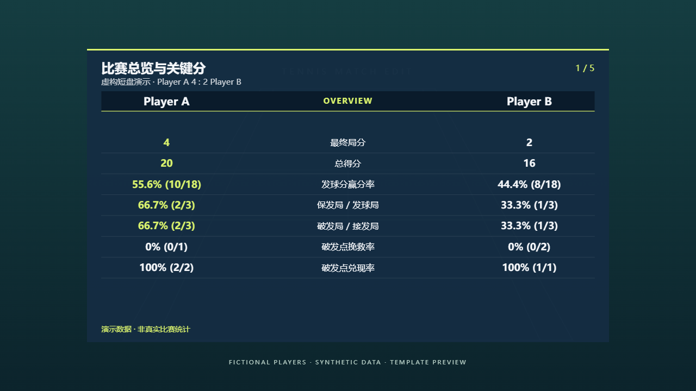
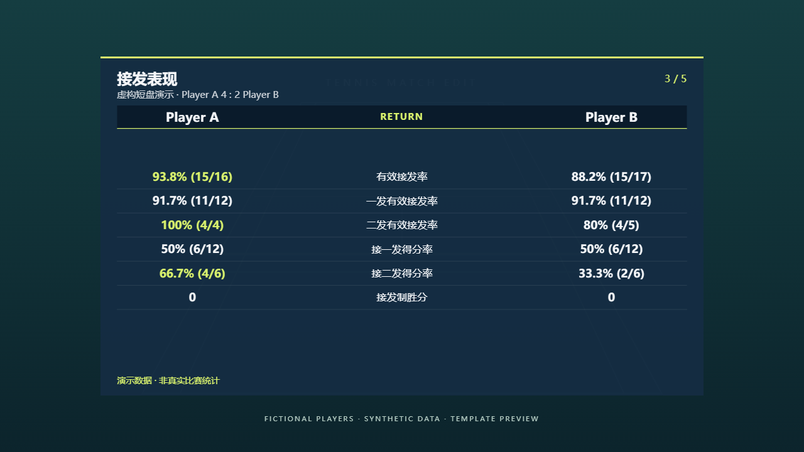
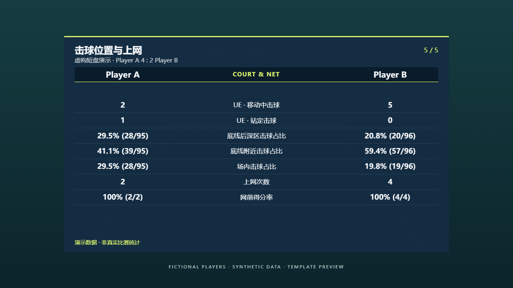
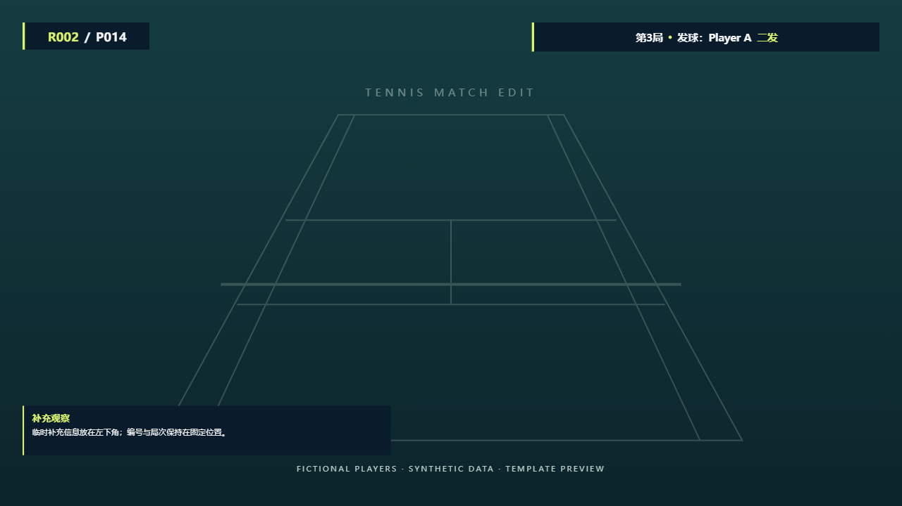

# Template gallery

All values come from the deterministic fictional fixture generated by
`demo/build_mock.py`. Player A / Player B are invented. The court background is
generated SVG. These images demonstrate layouts, not a real performance analysis.

## Scoreboard and post-contact serve label

## 1. Match overview

## 2. Serve and third shot

## 3. Return

## 4. Rally and shot outcomes

## 5. Court position and net

## Review identifiers and persistent context

The seven canonical JSX component files are rendered directly.
See [demo instructions](../demo/README.md) to regenerate the screenshots.
